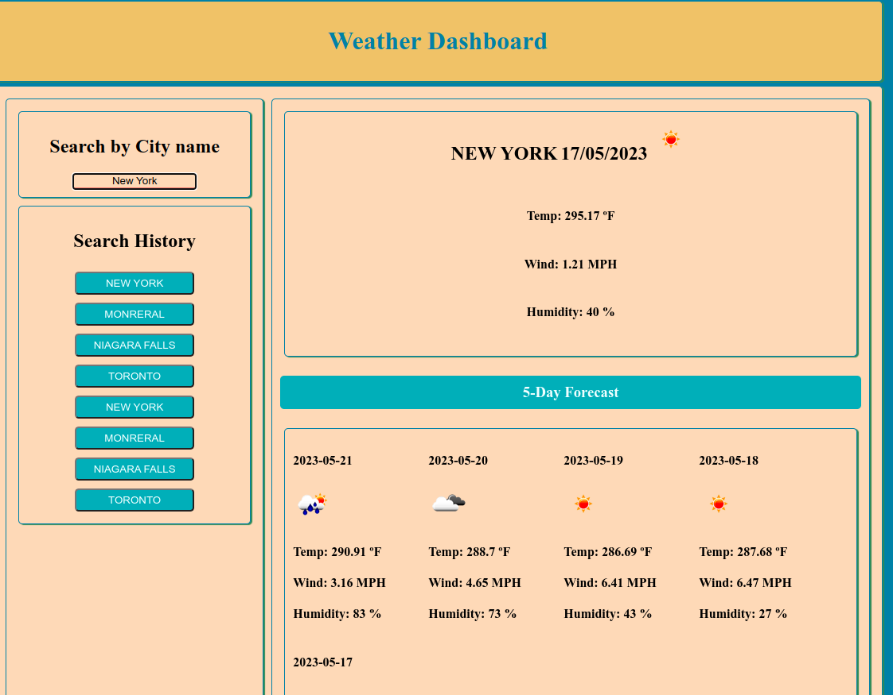

# https://miladesmailpour.github.io/challenges/


# 06 Server-Side APIs: Weather Dashboard

## User Story

```
AS A traveler
I WANT to see the weather outlook for multiple cities
SO THAT I can plan a trip accordingly
```

## Acceptance Criteria

```
GIVEN a weather dashboard with form inputs
WHEN I search for a city
THEN I am presented with current and future conditions for that city and that city is added to the search history
WHEN I view current weather conditions for that city
THEN I am presented with the city name, the date, an icon representation of weather conditions, the temperature, the humidity, and the wind speed
WHEN I view future weather conditions for that city
THEN I am presented with a 5-day forecast that displays the date, an icon representation of weather conditions, the temperature, the wind speed, and the humidity
WHEN I click on a city in the search history
THEN I am again presented with current and future conditions for that city
```


Challenges repository
This is an open source project which has Licensed by MIT which allow you to contribute and used open source codes used in this repo (All Branches).
More info: https://g.co/kgs/QWcHhF

  - Branches are named as module[n] and each one of them its unique challenge.
  - Master Branch contain the last solved challenge. (the read me your are reading trough, it is a defult guid when NO challage availabel to help you do a pre-setup.)
  
 # how to use the module and deploy
 
  - Clone the repo and make it own
      # Https url : 
          git clone https://github.com/miladesmailpour/challanges.git
      # ssh url :
          git clone git@github.com:miladesmailpour/challanges.git
      # Checking the fetch/pull and push url : 
          git remote -v
      # Modifing origin url : 
          git remote add origin [https/ssh url of you repo] https://docs.github.com/en/get-started/quickstart/create-a-repo
      # Verifing the fetch/pull and push url : 
          git remote -v https://docs.github.com/en/get-started/getting-started-with-git/managing-remote-repositories
      # Chacking the status of local : 
          git status
          
          "if local NOT updated"
          git add .
          git commit -m "[your comment]"
          git push origin master/main
   
   - Checkout to the module (the challenge you want to used and deploy)
      # Checkout to the disred challage : 
          git checkout module[n]
      # Verifing : 
          git status
      # [Make the change you wish to have]
          What do you think needed to improve?
      # Commiting to local and updating the GitHub repo: 
            git add .
            git commit -m "[your comment]"
            git push origin [your module name]
  - Moving Modules to Master Branch and deploy :
      # Creating a pull request to update the master/main : 
         https://docs.github.com/en/pull-requests/collaborating-with-pull-requests/proposing-changes-to-your-work-with-pull-requests/creating-a-pull-request
      # Deploy through the GitHub : 
         https://docs.github.com/en/pages/getting-started-with-github-pages/configuring-a-publishing-source-for-your-github-pages-site

# 06 Server-Side APIs: Weather Dashboard

## Your Task

Third-party APIs allow developers to access their data and functionality by making requests with specific parameters to a URL. Developers are often tasked with retrieving data from another application's API and using it in the context of their own. Your challenge is to build a weather dashboard that will run in the browser and feature dynamically updated HTML and CSS.

Use the [5 Day Weather Forecast](https://openweathermap.org/forecast5) to retrieve weather data for cities. The base URL should look like the following: `https://api.openweathermap.org/data/2.5/forecast?lat={lat}&lon={lon}&appid={API key}`. After registering for a new API key, you may need to wait up to 2 hours for that API key to activate.

**Hint**: Using the 5 Day Weather Forecast API, you'll notice that you will need to pass in coordinates instead of just a city name. Using the OpenWeatherMap APIs, how could we retrieve geographical coordinates given a city name?

You will use `localStorage` to store any persistent data. For more information on how to work with the OpenWeather API, refer to the [Full-Stack Blog on how to use API keys](https://coding-boot-camp.github.io/full-stack/apis/how-to-use-api-keys).

## User Story

```
AS A traveler
I WANT to see the weather outlook for multiple cities
SO THAT I can plan a trip accordingly
```

## Acceptance Criteria

```
GIVEN a weather dashboard with form inputs
WHEN I search for a city
THEN I am presented with current and future conditions for that city and that city is added to the search history
WHEN I view current weather conditions for that city
THEN I am presented with the city name, the date, an icon representation of weather conditions, the temperature, the humidity, and the wind speed
WHEN I view future weather conditions for that city
THEN I am presented with a 5-day forecast that displays the date, an icon representation of weather conditions, the temperature, the wind speed, and the humidity
WHEN I click on a city in the search history
THEN I am again presented with current and future conditions for that city
```
